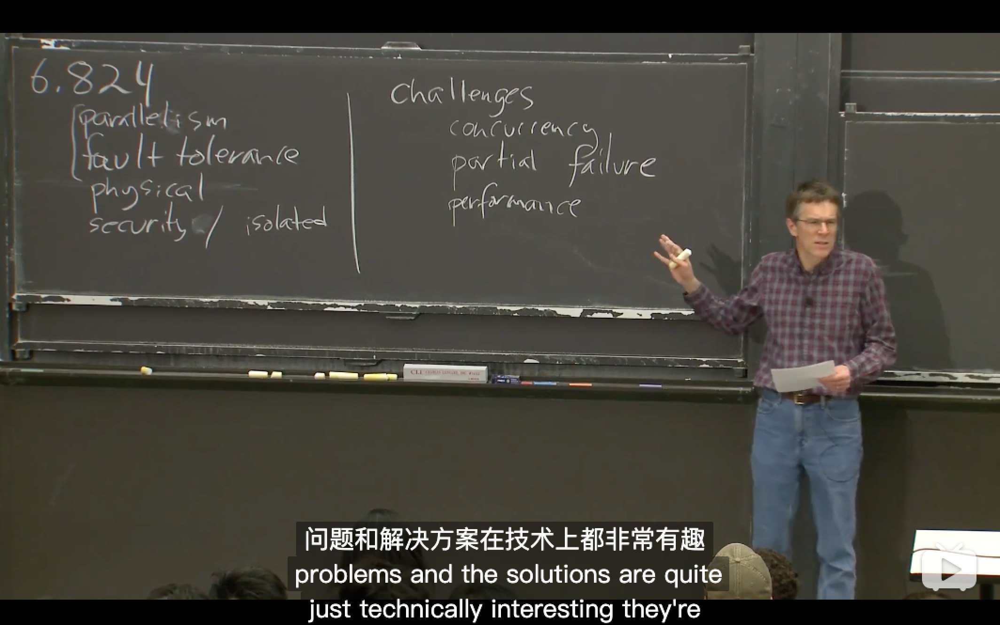

# MIT 6.824 lecture1_1
* 本章节的主要内容是MIT6.824分布式系统的一些简介。
* 这里是今年春季学期的[课表](https://pdos.csail.mit.edu/6.824/schedule.html)

* 这个课程开始的时候教授没有做自我介绍，我这里简单介绍下[Robert Tappan Morris](https://en.wikipedia.org/wiki/Robert_Tappan_Morris)（罗伯特·泰潘·莫里斯）教授。网络代号是rtm，现在是麻省理工学院教授。于2019年当选为美国工程院院士。1988年了创造互联网上的第一只电脑蠕虫程序。
* 言归正传开始MIT6.824。

### 0.分布式系统简介，驱动力和挑战（Drivens and Challenges）
* 什么是分布式系统：分布式系统的核心是一组协作的计算机通过网络互相通信以处理一些连贯的任务。
* 本课程会讨论的一些实际问题：
    * 大型网站的存储（侧重点存储）
    * MapReduce等大数据计算（侧重点是计算）
    * P2P文件共享（侧重点是通信）

* 在讨论分布式系统之前我们需要明确的一些问题：我们构建一个系统是为了解决一些特定的问题，如果你的问题可以在单台计算机上很好的解决的话，那么就无需构建分布式系统， 并且你在构建一个分布式系统之前应该尽可能尝试其他的一些方法（单机服务）。这是因为分布式系统的构建并不简单。

* 人们需要分布式系统的原因（驱动力）
    * 超越单台计算机的更高的性能（更多的CPU、内存、磁盘）
    * 容错（tolerate faults）比如两台计算机运行完全相同的任务，其中一台发生故障，可以切换到另一台。
    * 一些自然的物理原因（你在两间银行之间转账，一间在纽约，一间伦敦。这种天然的物理上的分隔）
    * 达到某种安全目标，例如：与你交互的一些其他的程序或者代码，你不确定他的安全性，你想确保他的代码在其他的机器上运行，你的代码在另外一些机器上运行，他们只通过某些特定的网络协议进行交流，以达到可控。 这里教授应该想表达的是：对不确定性和大部分的故障进行隔离。

* 构建分布式系统的困难（挑战）
    * 因为系统中存在很多部分，这些部分又在并发执行，你会遇到并发编程和各种复杂交互所带来的问题，以及时间依赖的问题（比如同步，异步）。
    * 是因为多个不同的组件通过网络来进行交互，单台计算机有可能是正常工作或者故障，分布式系统可能是某些零件故障或者每台计算机工作正常，网络出现了故障或者不可靠等等。引入的问题不是线性增长，而是相乘或者指数级别的增长。
    * 我们构建分布式系统的一个很大的初衷就是希望通过增加节点的方式来提高整个系统的性能，但是要做到性能线性的增长也是困难的，大多数情况下，性能不是简单的多个节点相加。所以通常需要倍加小心地设计才能让系统实际达到你期望的性能。

* 这里我想谈谈我自己对分布式系统故障的看法：单台机器的故障可能导致一个系统或者一个服务的完全瘫痪，某种意义上分布式系统可以容忍一些节点的故障或者不可靠，这也是分布式系统的一个优。但是随着一个系统中各类节点的增多，整个系统中出现故障节点的概率也是大大增加的，所以这既是分布式系统的一个亮点也同样是他的一个挑战。

* 教授说：问题和解决方案在技术上都很有趣。对于这些问题，有些有很好的解决方案，有些就没有那么好的解决方案。他开始接触分布式系统时更多的是学术上的兴趣，但是随着分布式系统这20多年的发展，凭借大型网站的应用，分布式系统作为更多的计算基础架构的重要组成部分。这意味着他引起的更多人的关注，并且也解决了很多现实的问题。但是，依旧还有很多没有解决的问题。
<<<<<<< Updated upstream

=======
    
>>>>>>> Stashed changes

### 1.本课程的结构（Course Structure）
* lectures
* papers
* exams
* labs
    * MapReduce
    * Raft for fault tolerant
    * KV Server
    * Sharded KV Server
* project

### 2.分布式系统的抽象和实现工具（Abstraction 、Implementation 、tool ）
* 这是一门有关基础架构的课程，我会将第三方的应用和这些基础架构的服务分开来讲。贯穿于我们课程的主要是三部分：Storage（存储），Communication（通信），Computation（计算）
* 实际中我们最关注的是存储系统，因为它是定义非常明确且很有用的抽象，人们通常知道如何使用和构建存储系统，并且提供复制、容错、高性能、分布式的实现。
* 我们还将对类似于MapReduce等这类计算系统进行讨论。我们还会涉及到一些通信的问题，但是主要的出发点：通信是我们构建分布式系统的工具。比如不同的计算机可能需要通过网络相互通信，但是需要保证一定的可靠性。实际上我们更多是使用已有的通信方式。
* 对于存储和计算，我们的目标是尽量的将他们设计成一些接口，让第三方的服务可以使用分布式的存储和计算，这样才能轻松的在基础架构之上构建丰富的第三方服务。希望通过这种抽象的接口，将分布式特性隐藏在整个系统内。尽管这几乎是无法实现的梦想，但是我们确实希望建立这样的接口，这样从应用程序的角度来看，整个系统是一个非分布式的系统，就像一个文件系统或者一个大家知道如何编程的普通系统，并且有一个非常简单的模型语句。构建这样一个接口，它看起来就像一个非分布式存储和计算系统一样，但是实际上又是一个有极高的性能和容错性的分布式系统。
* 我们常用于构建分布式系统的工具：
    * RPC（Remote Procedure Call）。RPC的目标就是屏蔽我们时时刻刻正在不可靠网络上通信的事实。
    * 线程：这是一种编程技术，使得我们可以利用多核心计算机。对于本课程而言，更重要的是，线程提供了一种结构化的并发操作方式，这样，从程序员角度来说可以简化并发操作。
    * 因为我们会经常用到线程，我们需要在实现的层面上，来考虑并发控制，比如锁等。
    